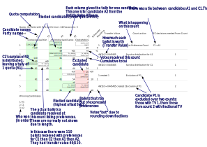

# Interpretation of transcript

The transcript viewer shows how votes were assigned to candidates during the counting
process. This is conceptually quite simple; one has a table with a column for each candidate.
The process consists of multiple _counts_ being either first preference assignment,
surplus distribution, or candidate exclusion; in each count some votes are moved around and
assigned to candidates. There is a row for each count.

In practice, this is quite complex as there are many things going on. A very simple
election that shows most of the things going on is included here as an example
with an annotated transcript at the end.

There are 240 voters in this election, with the 5 candidates C1, C2, A1, A2 and P1
contesting 3 available vacancies. This means the quota is 240/(3+1)+1=61.
There are 3 parties.
* The _Clockwise Coalition_ with candidates C1 and C2
* The _Anticlockwise Alliance_ with candidates A1 and A2
* The radical _Clockphobics_ with one candidate P1

The voters are not very creative, and there are only 5 different
preference lists produced
* 110 voters voted on party lines for the Clockwise Coalition then the Anticlockwise Alliance. That is candidates C1 then C2 then A1 then A2.
* 100 voters voted on party lines for Anticlockwise Alliance then the Clockphobics then the Clockwise Coalition.
* 10 voters voted A1 then P1 then (presumably reluctantly) A2.
* 10 voters voted P1 then A1 then A2.
* 10 voters voted just P1. They became exhausted on count 4 when P1 was excluded.

In the first preference count, candidates C1 and A1 both go over quota and are therefore elected.

In the second count step, A1's surplus of 49 votes are distributed. 44.54... rounded down to 44 go to A2, 
and 4.45... rounded down to 4 go to P1. 

In the third count step, C1's surplus of 49 votes are distributed, all to C2.

In counts 4 and 5, P1 gets excluded. In count 4 the 20 votes received by first preferences
get distributed, 10 to A2 (as A1 is already elected and ineligible to get more votes),
and 10 are considered exhausted as there are no other candidates listed. In count 5
the 10 ballots worth 4 votes received on count 2 get distributed all to A2.
At this point there are only two remaining candidates and one remaining vacancy, and
so the one with a higher tally (A2 on 58) is declared elected and the election is over.

The resulting transcript is as follows:



The [vote data that produced this](SimpleExample.stv) is provided; the
command to compute the transcript [assuming you have already compiled
ConcreteSTV](../README.md) was:
```bash
cd examples
../target/release/concrete_stv --verbose --include-list-of-votes-in-transcript AEC2013 SimpleExample.stv
```

Then the resulting file `SimpleExample_AEC2013.transcript` was loaded into the [viewer](https://andrewconway.github.io/ConcreteSTV/Viewer.html).
